--------

Back to portfolio homepage: [Technical & UX Writing Portfolio](./../README.md)

--------

# Scaling Amazon GuardDuty documentation through content strategy and information architecture

Amazon GuardDuty expanded rapidly across protection plans, findings workflows, and multi-account environments. As the sole documentation owner, I needed to support ongoing feature launches while addressing discoverability issues identified through benchmark studies, user feedback, and support channels.

Contents:
- [Challenge](#challenge)
- [Approach](#approach)
- [Key improvements](#key-content-improvements)
- [Outcomes](#outcomes)
- [Key takeaways](#key-takeaways)

## Challenge

The documentation itself was accurate, but years of feature growth had introduced content debt. Information had become buried inside long pages, fragmented across related topics, or no longer reflected evolving product behavior and user workflows.

Because feature work consumed most of the available bandwidth, a large-scale rewrite seemed impractical. Instead, I needed to prioritize improvements that would deliver the greatest value to customers while continuing to support new launches.

## Approach

I used Adobe Analytics to identify high-traffic topics and prioritized focused improvements instead of attempting a full documentation overhaul.

I held recurring reviews with a small group consisting primarily of a principal solutions architect, product manager, and subject matter experts. Sessions started weekly and shifted to biweekly during periods of heavy release activity.

Before each session, I prepared annotated PDFs highlighting ambiguous content, customer pain points from Slack channels, documentation feedback, and opportunities to improve discoverability.

Rather than treating content audits as separate projects, I integrated quality improvements into ongoing release work.

To prioritize improvements, I combined analytics, benchmark studies, documentation feedback, customer pain points, and SME reviews.

## Key content improvements

- [Evolving the landing page experience](#evolving-the-landing-page-experience)
- [Improving information architecture for findings workflows](#improving-information-architecture-for-findings-workflows)
- [Improving multiple-account workflows](#improving-multiple-account-workflows)
- [User feedback-driven export findings improvements](#user-feedback-driven-export-findings-improvements)

### Evolving the landing page experience

The **What is GuardDuty** landing page evolved from a simple service overview into a more effective entry point for wayfinding. I added feature descriptions, documented available protection plans, and separated pricing into its own topic to clarify differences between pricing models for each protection plan. During reviews with the product manager, we also incorporated industry compliance information such as PCI DSS support.

Multiple review cycles transformed the page from an overview page into a more effective entry point that introduced GuardDuty features, protection plans, different pricing models, and AWS integrations before users explored more detailed information. 

#### Before

Web archive for What is GuardDuty: https://web.archive.org/web/20240418224907/https://docs.aws.amazon.com/guardduty/latest/ug/what-is-guardduty.html

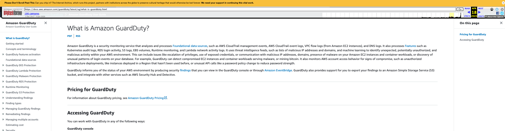

#### After

Referenced documentation: [What is GuardDuty](https://docs.aws.amazon.com/guardduty/latest/ug/what-is-guardduty.html)

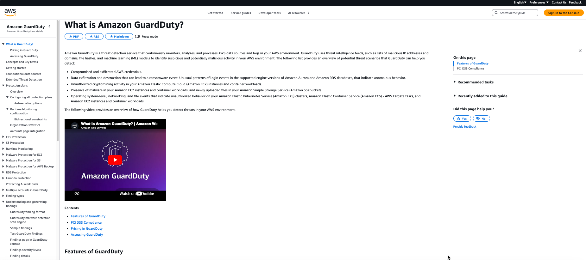

Moved **Pricing** page into a dedicated standalone topic.

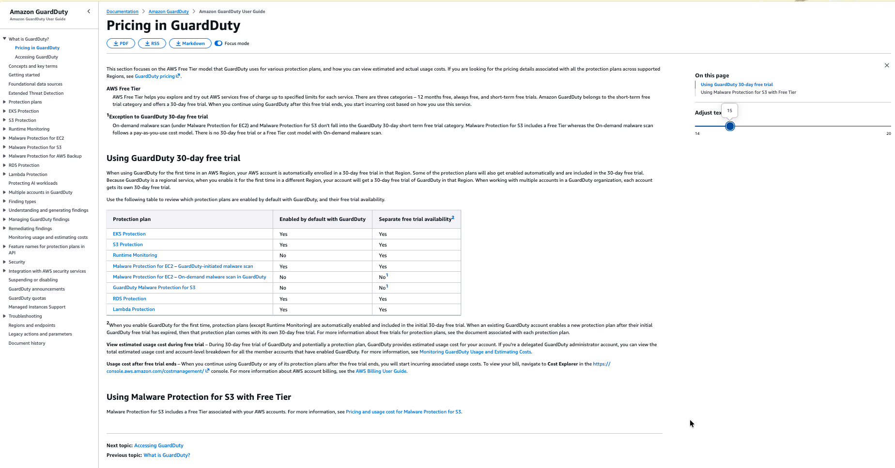

### Improving information architecture for findings workflows

As findings-related content expanded, I continuously reviewed existing topics for structure, task naming, and style-guide adherence. I surfaced previously buried workflows, renamed topics to better align with user tasks, and expanded high-traffic pages such as **Viewing generated findings in the GuardDuty console**. Additionally, I replaced a dense table with a variable list to improve readability and accessibility. 

The goal was to help customers discover information directly through navigation instead of relying on long pages.

#### Before

- Web archive for Understanding findings: https://web.archive.org/web/20240521221811/https://docs.aws.amazon.com/guardduty/latest/ug/guardduty_findings.html

- Web archive for Managing findings: https://web.archive.org/web/20240521221811/https://docs.aws.amazon.com/guardduty/latest/ug/findings_management.html

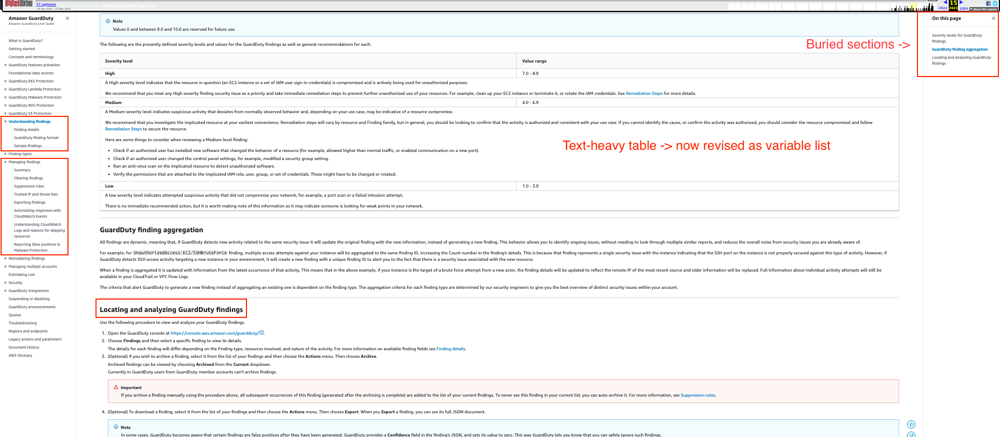

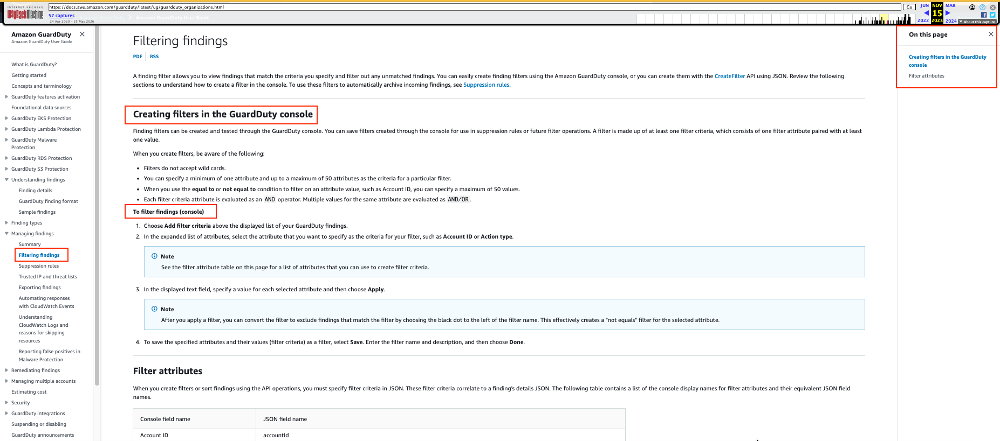

#### After 

In **Understanding findings**, previously buried sections such as finding severity levels, finding aggregation, and locating and analyzing GuardDuty findings became standalone topics. I renamed the latter topic to **Viewing generated findings in GuardDuty console** and expanded it to explain navigation, filtering, sorting, and attack sequence findings.

I applied the same task-oriented approach to **Managing findings**, where suppression-rule workflows became directly discoverable and **Filtering findings** was updated to better reflect user actions. Later additions, such as entity list workflows, were surfaced directly in navigation to improve discoverability.

Referenced documentation:

- [Understanding and generating findings](https://docs.aws.amazon.com/guardduty/latest/ug/guardduty_findings.html)

- [Managing findings](https://docs.aws.amazon.com/guardduty/latest/ug/findings_management.html)

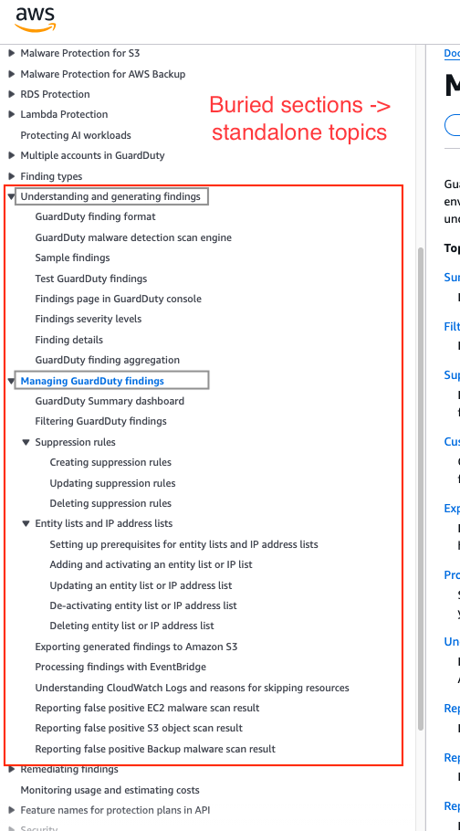

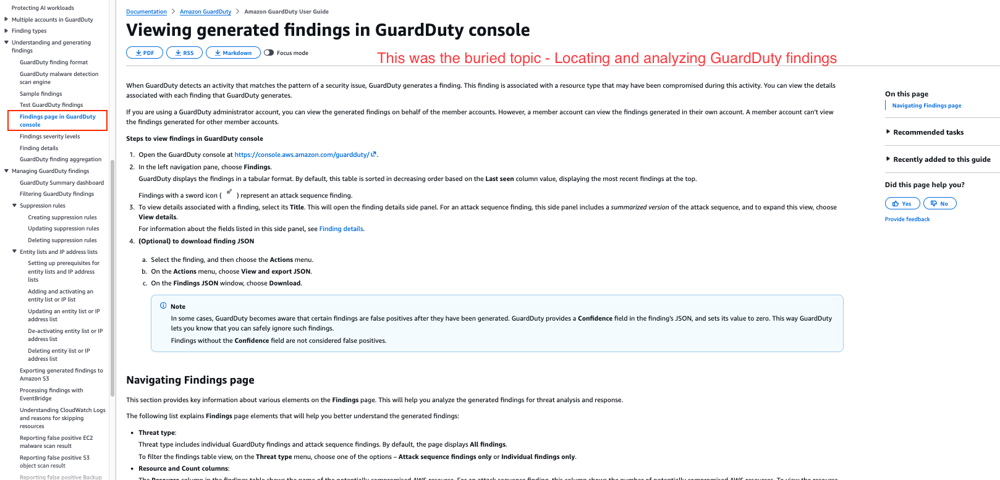

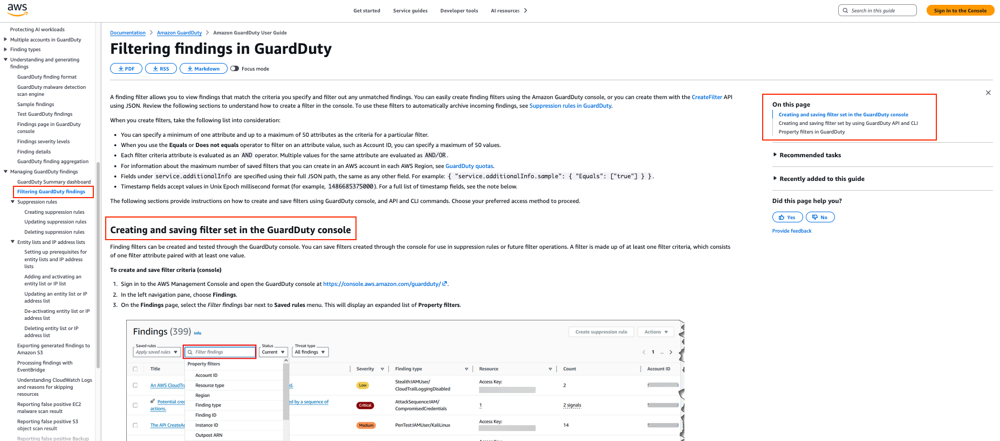

### Improving multiple-account workflows

Documentation feedback and support tickets highlighted recurring customer pain points in multi-account environments.

Working with a software development manager over several months, I decomposed large pages into standalone tasks and documented scenarios that previously required support tickets, particularly around disassociating, suspending, and deleting member accounts, as well as other edge-case workflows.

Overall, I created **six additional task-oriented topics**, including one workflow introduced to align with changes in the console experience.

#### Before table of contents

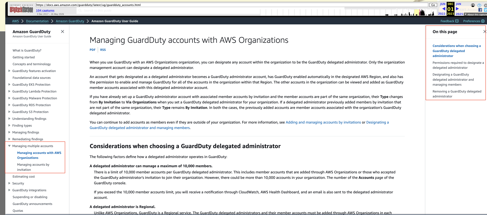

#### After table of contents

Referenced documentation: [Multiple accounts in Amazon GuardDuty](https://docs.aws.amazon.com/guardduty/latest/ug/guardduty_accounts.html)

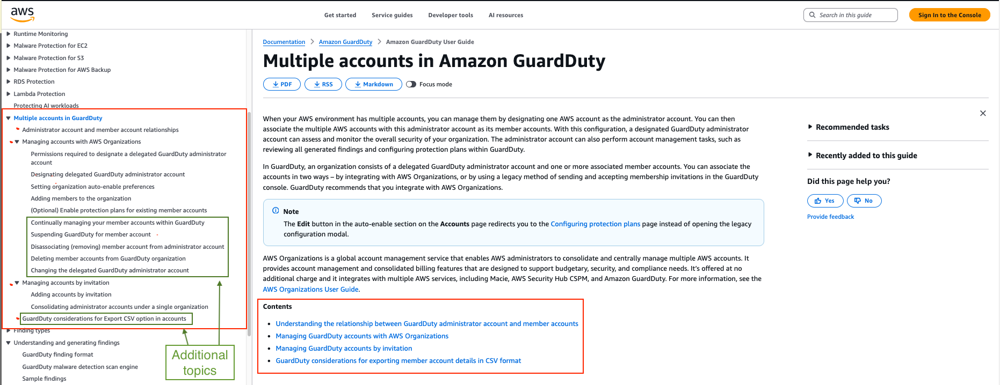

### User feedback-driven export findings improvements

Customer feedback and recurring issues involving KMS permissions and Amazon S3 bucket policies highlighted confusion around findings export workflows. I reproduced the steps and escalated the issues to the owning team. In parallel, the console experience was being refreshed to align with newer UX practices. 

I contributed console text, updated policy guidance, and restructured the topic by separating concepts from tasks to improve workflow clarity for users. 

I reorganized a single topic into a workflow-oriented structure by separating considerations, prerequisites, and configuration steps.

#### Before

Web archive for Creating custom responses to GuardDuty findings with Amazon CloudWatch Events: https://web.archive.org/web/20240313192637/https://docs.aws.amazon.com/guardduty/latest/ug/guardduty_findings_cloudwatch.html

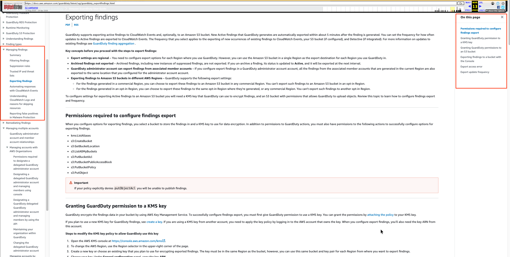

#### After

Referenced documentation: [Exporting generated GuardDuty findings to Amazon S3 buckets](https://docs.aws.amazon.com/guardduty/latest/ug/guardduty_exportfindings.html)

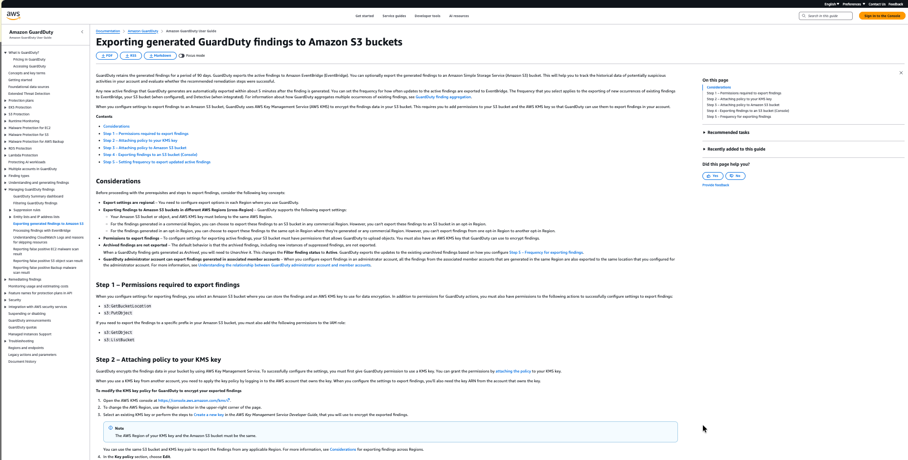

## Outcomes

- Documentation improvements **received positive page ratings** and addressed recurring areas of confusion in high-traffic workflows.
- Completed these improvements alongside three feature launches, approximately 24 *published* documentation updates, and recurring reviews with solution architects, product managers, and SMEs during Q3 and Q4 2024.
- Reorganized high-traffic chapters into a more task-oriented information architecture and surfaced previously buried workflows directly in navigation.
- Added and expanded topics covering edge cases identified through recurring support tickets and documentation feedback.

## Key takeaways

This work demonstrated that documentation quality improvements do not always require large rewrites. 

By combining analytics, benchmark studies, support feedback, and recurring stakeholder reviews, I incrementally improved high-traffic content while continuing to support feature launches.