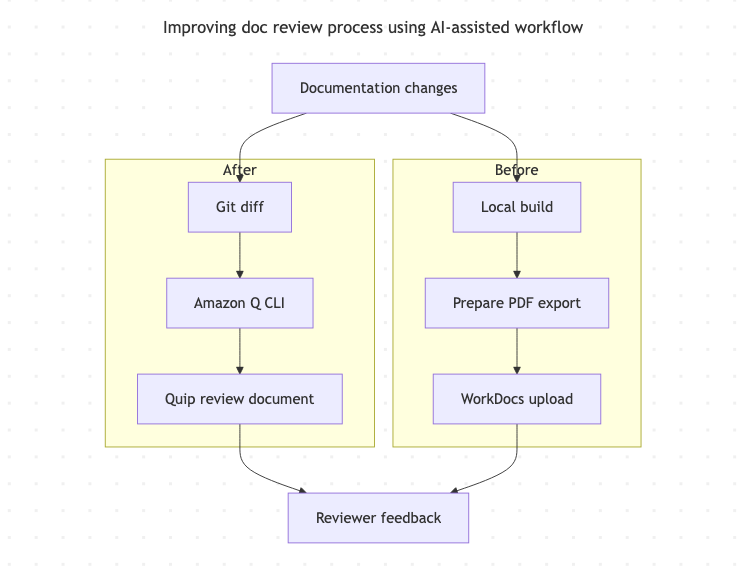

# Improving documentation review efficiency with AI-assisted workflow

For documentation reviews, technical accuracy often involved multiple engineering stakeholders, and review feedback frequently arrived close to release milestones.

Because documentation updates were tied to feature launches, delayed reviews often had the risk of last-minute documentation churn and created additional prioritization challenges as release dates approached. 

## Challenge

At AWS, stakeholders commonly collaborated by using [Quip](https://quip.com/) for design reviews, project documentation, and cross-functional discussions.

However, the documentation reveiew workflow relied on a separate process:

1. Generate a local documentation build.
2. Create a PDF from the generated HTML. 
3. Extract impacted pages in Adobe PDF and save it as a new PDF, or highlight new or updated sections manually.
4. Upload the file to WorkDocs.
5. Track comments and follow-up questions across multiple versions.

This workflow had the following inefficiencies:

- For feature launches, even minor doc updates required uploading a new PDF version.
- Preparing review material required significant manual effort.
- Review cycles often stretched to a week or longer.
- Reviewers occasionally encountered access issues. Emails about requesting access would come after an hour or so. 
- By design of WorkDocs, comment history was distributed across PDF versions. 
- Unless tagged in the comments, I would not receive notifications when a reviewer added a comment, causing delays in addressing the feedback.  

Additionally, directly pasting content from local HTML build into Quip often resulted in inconsistent heading styles, table formatting issues, and missing content from tabbed sections.  

The **challenge** was reducing review preparation effort and shortening review turnaround while continuing to work within approved AWS tools and processes.

## Solution

I designed and adopted an AI-assisted review workflow by integrating Amazon Q CLI, a Quip MCP server, and git-based documentation workflows.

Instead of generating full documentation builds and manually annotating PDFs, I used a git diff command to identify changed content and generate review-ready material directly in Quip.

The workflow helped me do the following:

- Identify only the `.xml` documentation files that changed.
- Generate targeted review content from updated XML files.
- Create review documents directly in shared Quip folders. Reviewers using the Quip Slackbot automatically received Slack notifications when a new review document was created.
- Add clarifying questions and contextual review annotations alongside content updates. 
- Maintain discussions and feedback (comment) history in a single file version.

Because stakeholders already used Quip extensively in their day-to-day work, adoption was immediate and reviewers often engaged with content more quickly than through the previous PDF-based workflow.

Workflow for improving documentation review efficiency with AI-assisted workflow.

## Results

These results were most noticeable during extra large (XL) and large feature launches, where requirements and content changed frequently until code freeze or launch.

### Measured outcomes

- Based on multiple documentation reviews, preparation time decreased from approximately 30–60 minutes to 5–10 minutes because I no longer had to generate PDFs, extract impacted pages, upload them, and annotate them manually.
- Increased reviewer engagement by using existing collaboration workflows. Reviewer turnaround was commonly reduced from roughly a week to 1–3 days.
- Eliminated the need for building the entire doc package for most review cycles. Building the doc package once used to take 5-7 minutes.

### Non-quantitative outcomes

- Review comments remained attached to the content being discussed.
- Notifications through Quip and Slackbot improved responsiveness.
- The process became repeatable across future documentation projects.
- Documentation reviews became relatively easier to scale across concurrent feature launches.

## Trade-offs and troubleshooting

The workflow significantly improved review efficiency, but it also introduced new challenges.

### Preserving comment history

When updating existing Quip documents, the content would get appended and not change in the original sections. When I addressed this issue, I observed replacing content could remove comments attached to earlier doc versions. To preserve history, I adapted the workflow by:

- Addressing small updates directly in existing Quips.
- Creating new review documents for larger revisions and adding them to the top of the original Quip with a date and timestamp. For new features, I would add a link to the open comment from the previous discussion. If it was okay, I would strikethrough the older content and add the new content below it. 

### HTML links not appearing

Some HTML links occasionally failed to render correctly when content was added to Quip. While I experimented with prompt refinements, the issue remained inconsistent and was resolved through minor manual cleanup during review preparation time.