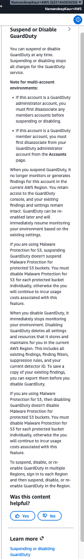
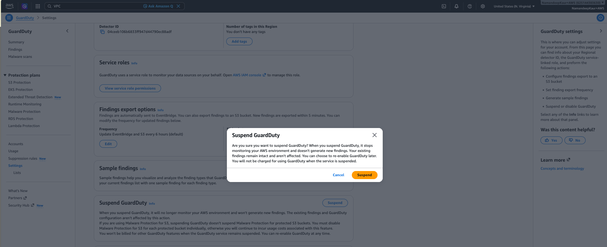
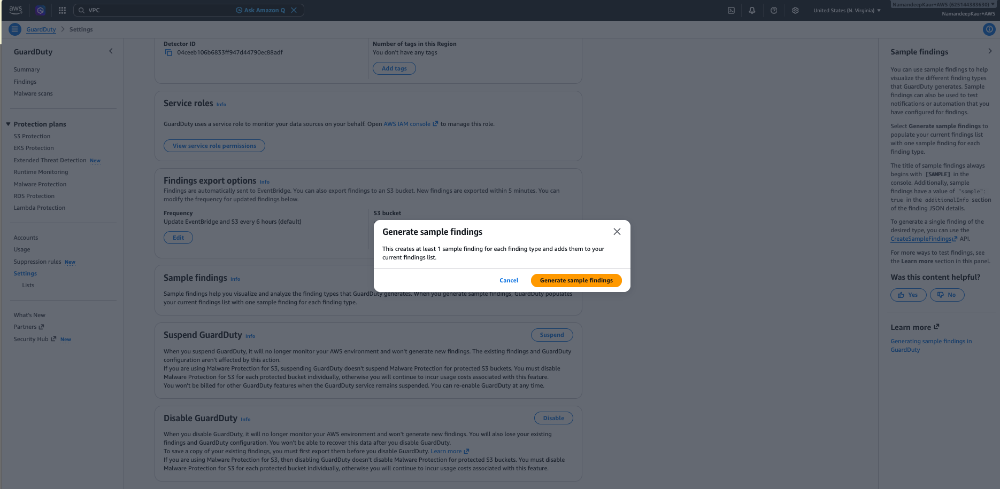
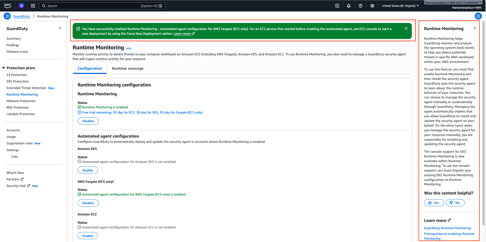
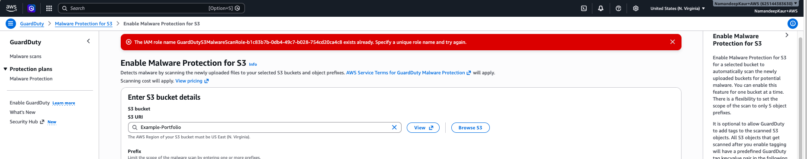
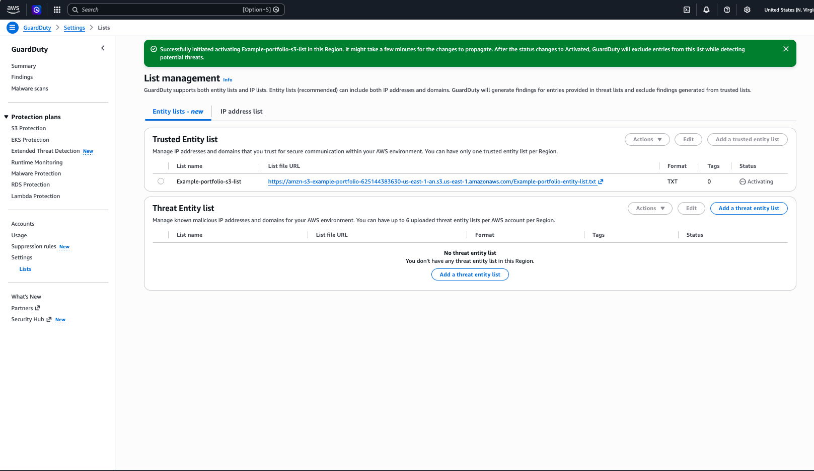
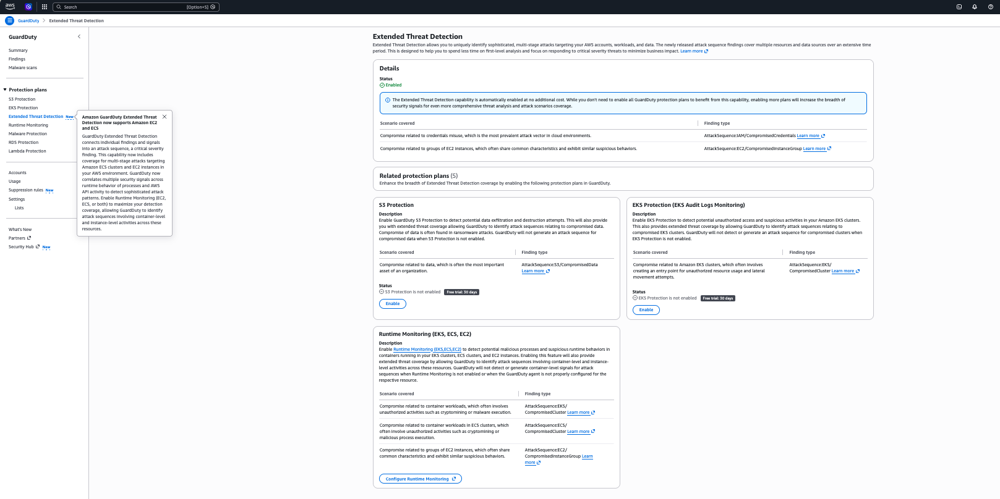

--------

Back to portfolio homepage: [Technical & UX Writing Portfolio](../../README.md)

--------

# Helping users understand GuardDuty workflows through in-product content

In addition to documentation, I contributed user-facing content for Amazon GuardDuty console experiences. To shape and support the overall customer experience beyond traditional documentation, I included help panels, confirmation dialogs, success and error messages, error states, accepted input constraints, and feature configuration guidance.

For these contributions, I collaborated with product managers, UX designers, and front-end engineers, and aimed to improve clarity, consistency, and customer understanding.

## What I did

- Helping users understand complex security workflows
- Crafting errors and recovery path guidance
- Communicating in-progress, success, and error states
- Improving terminology and content consistency
- Supporting onboarding and feature configuration

## Key scenarios

The following screenshots represent my contribution to Amazon GuardDuty console experience. 

### GuardDuty settings page

Contributed content for account-level settings and maintenance operations, including the following:

- Export findings configuration text
- Generate sample findings workflow text
- Suspend and disable confirmation dialogs
- Contextual help panels explaining functional behavior

**Example 1**: Contextual guidance explaining the difference between suspending and disabling GuardDuty. 

**Why was this important?**

Because suspending and disabling are critical decisions, a help panel focusing on consequences seemed to be a better approach than only sharing doc links. 

Additionally, using the Malware Protection for S3 feature independently has a separate disable workflow. To prevent unintentional charges and clarify differences between disabling GuardDuty and disabling Malware Protection for S3, important behavioral differences were explained directly in the console rather than relying **only** on documentation links.

**Example 2**: Confirmation dialog describing the impact of suspending GuardDuty. 

**Why was this important?**

Suspending GuardDuty is a high-impact action that stops monitoring while preserving existing findings. The previous workflow provided little context about the consequences. Adding a confirmation dialog reduced ambiguity and gave users one final opportunity to understand the impact before proceeding. Similar guidance was also applied to the disable workflow.

**Example 3**: Confirmation workflow for generating sample findings. 

**Why was this important?**

Generating sample findings can populate the Findings page with hundreds of entries. Although the action is low risk, users benefit from understanding the scale of the change before proceeding. 

The confirmation dialog sets expectations and helps users understand the impact before populating the Findings page with sample entries.

**What I would change now**

Because generating sample findings can add hundreds of entries, I would include guidance on filtering sample findings after generation. I would surface this in the success flashbar so that users can immediately find the generated results.

### Runtime Monitoring

Contributed content for Runtime Monitoring workflows, including:

- Success and error flashbar messages
- Confirmation dialogs
- Runtime coverage and status message
- Help panel content explaining agent management and prerequisites

**Example 4**: After enabling automated agent configuration, the success message also provides functional guidance.

**Why was this important?**

Users expected runtime coverage immediately after enabling automated agent configuration. In practice, existing ECS services require redeployment for effective coverage. Adding this functional guidance directly to the success message clarified the next action and reduced the need to search the troubleshooting doc. This addressed a recurring source of customer confusion.

### Malware Protection for S3

Contributed form guidance and validation content for enabling Malware Protection for S3, including the following:

- Bucket scope options
- Tagging explanations
- Service-role configuration guidance
- Validation and error messaging

**Example 5**: Flashbar error message along with further guidance for the user.

**Why was this important?**

The flashbar error message shows that the problem exists. Users need actionable guidance on how to troubleshoot without leaving the workflow. The surrounding help panel content reduced the need to abandon the task or search documentation.

### List management

Contributed workflow text and status messages supporting creation and management of trusted and threat entity lists and IP address lists.

**Example 6**: Success flashbar message for creating an entity list setting GuardDuty behavioral expectation for the user.

**Why was this important?**

Because there can be only one trusted entity list per account per region, adding a new list doesn't automatically guarantee activation. Users must explicitly activate the list before GuardDuty can actually use it. 

After creating the list, its **Status** remains **Inactive**, which can be confusing for users. I anticipated user questions and added a sentence about expected GuardDuty behavior and also added the same in the GuardDuty user guide documentation.

### Extended Threat Detection feature

Contributed microcopy and reviewed UI text for the GuardDuty Extended Threat Detection experience.

**Example 7**: Microcopy for Extended Threat Detection feature education.

**Why was this important?**

Extended Threat Detection is enabled automatically, but its coverage depends on certain protection plans enabled in the account. This page educates users about these dependencies and provides direct configuration paths to enable additional protection plans without requiring them to leave the workflow.

