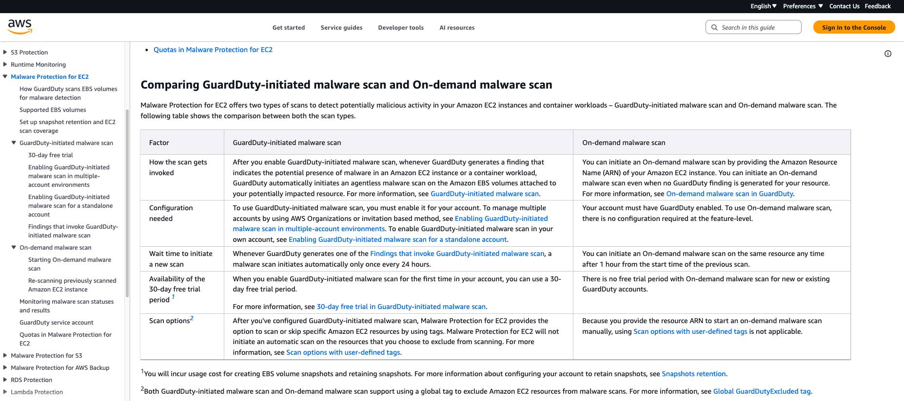
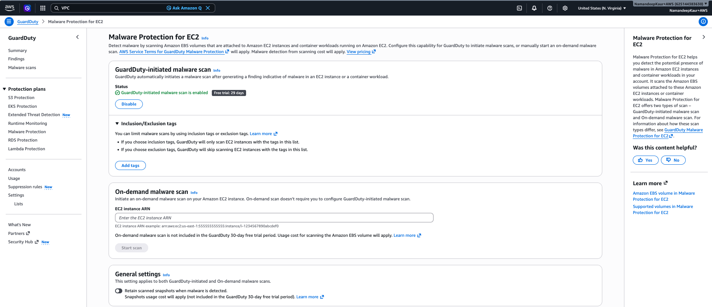
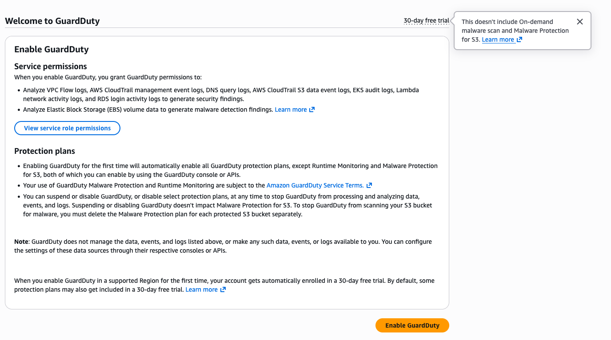

--------

Back to parent case study: [Scaling content and onboarding for evolving Malware Protection workflows](README.md)

--------

# Supporting the transition from single workflow to two scan models

When [Malware Protection](https://docs.aws.amazon.com/guardduty/latest/ug/malware-protection.html) first launched, malware scans were initiated automatically based on specific GuardDuty findings. A later release introduced on-demand scanning capabilities, allowing users to initiate scans manually and re-scan resources after a specified interval. 

This change introduced a second scan model with different prerequisites, pricing considerations, quotas, and fucntionality.

## Key questions

To understand the user journey and identify potential points of confusion, I worked with product managers, engineers, and UX stakeholders to answer questions such as:

- Why would a user choose on-demand scan?
- What prerequisites are required?
- What were the differences between both the approaches?1
- How the console experience changes for the user? Was there any default enablement like other protection plans?2
- How the pricing differed from the existing GuardDuty-initiated scan workflow?
- Are there any new quotas that impact only on-demand malware scan use case?

## Key contribution

I documented the behavioral differences between GuardDuty-initiated and on-demand scans, created comparison guifance, expanded the existing Malware Protection documentation for the new scan model, updated content to reflect new workflows, and supported console content updates so that users could understand when each scan model applied and what behavior to expect.

I also did a walkthrough of the existing 'Welcome to GuardDuty' console page, noted the 30-day free trial callouts3, and shared the updates with the console team to honestly reflect the new pricing guidance. 

## Outcome

The resulting content helped users understand the different scan approaches, pricing considerations, scan behavior, and functional expectations. Users could easily determine which scan model applied to their use case and understand how the workflows differed.

## Supporting documentation and console experience

1Comparison guidance explaining the differences between scan approaches.

2Console experience after introducing on-demand malware scans.

3Console update clarifying that the 30-day free trial doesn't apply to on-demand malware scans (Welcome to GuardDuty screen).

