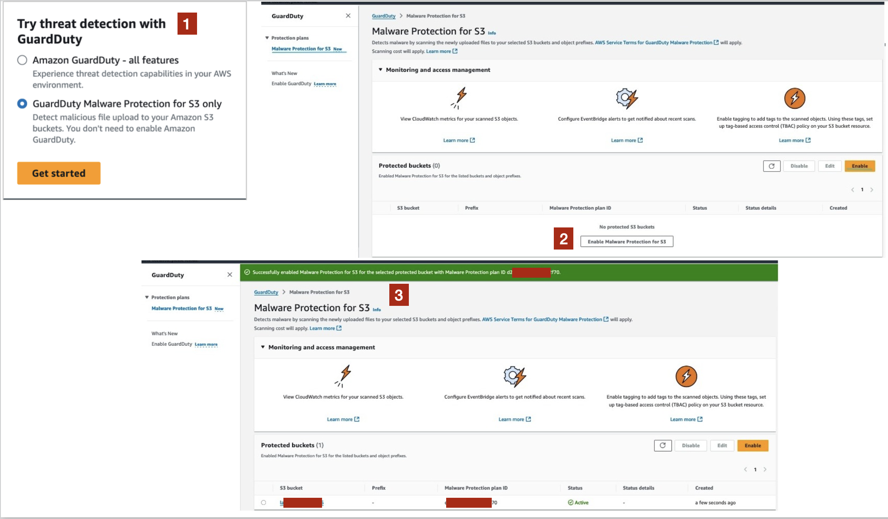

--------

Back to parent case study: [Scaling content and onboarding for evolving Malware Protection workflows](README.md)

--------

# Clarifying standalone Malware Protection for S3

When [Malware Protection for S3](https://docs.aws.amazon.com/guardduty/latest/ug/gdu-malware-protection-s3.html) launched, it became the first Malware Protection capability that users could use without enabling GuardDuty. This introduced a new onboarding path and different user expectations. 

Although both approaches scanned newly uploaded S3 objects for malware, the resulting workflows, findings behavior, and prerequisites were different.

## Key questions

To understand the user journey and identify potential points of confusion, I worked with product managers, engineers, and UX stakeholders to answer questions such as:

- What is the entry point to use standalone experience?
- What permissions and prerequisites are required?
- Which functionality is still available without GuardDuty?
- How does pricing differ?
- How can users monitor scans and view scan results?
- What happens when malware is detected?
- Can users enable GuardDuty at a later time?
- When users enable GuardDuty after a scan completes, are the previous malware scans accessible, and will GuardDuty generate findings pertaining to old scans where threat was detected?
- What happens when a user disables the protection plan, both for standalone and integrated with GuardDuty experience?
- For standalone experience, is there a separate quota for Malware Protection for S3 users?

One particularly important area was explaining how workflow behavior changed when GuardDuty is not enabled. For example, with standalone experience, users could view scan results, configure EventBridge notifications, and tag scanned S3 objects. However, GuardDuty findings were generated only when GuardDuty was enabled because findings require an associated detector ID that is unique to each GuardDuty account in every region.

## Key contribution

I created getting started guidance, console content, and feature explanations that clarified the following for the users:

- What functionality was available without GuardDuty
- What it meant for GuardDuty to be optional
- How scan results could be monitored
- Which actions generated GuardDuty findings
- How standalone and integrated behaviors differed

## Standalone Malware Protection for S3 enablement flow

The following image shows the enablement path for standalone Malware Protection for S3 user experience.

## Outcome

The resulting content helped users understand whether they needed the full GuardDuty experience or only Malware Protection for S3. It also established content patterns that were later reused as Malware Protection expanded into additional standalone protection plans. 