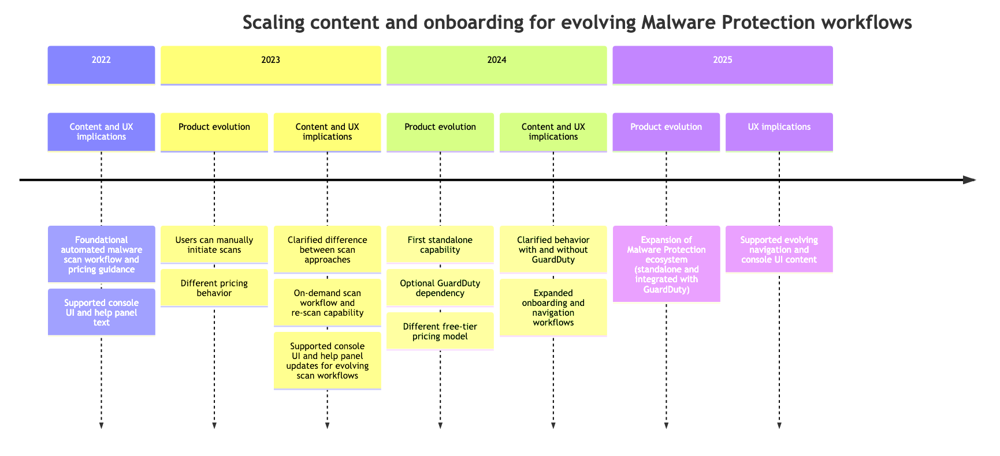

# Scaling content and onboarding for evolving Malware Protection workflows

Amazon GuardDuty Malware Protection helps users detect potential malware in specific AWS resources. Over several releases, Malware Protection evolved from a malware scanning workflow focused on Amazon EC2/EBS resources into a broader ecosystem supporting on-demanding scans, standalone Malware Protection for S3, and different setting up experiences in Malware Protection for AWS Backup. 

## Overview

As the Malware Protection feature evolved, the documentation and console UI text experiences also needed to evolve and scale. New workflows introduced different user jouneys, getting started decisions with and without GuardDuty, different scan approaches, and this impacted whether GuardDuty secruity findings will be generated post malware scan. 
 
Users needed to understand how and when the malware scans were triggered automatically versus manually, how pricing and free-tier behavior differed across workflows, what benefits would they get when GuardDuty was also enabled versus using standalone options, and what benefits did invidual Malware Protection plans had to offer. 

The following image provides an overview how Malware Protection evolved from June 2022 to October 2025.

I supported these evolution through end-to-end documentation ownership, console UI and help panel text contributions, getting started guidance, including prerequisites/permissions, functional differences, and information architecture and content design plans and discussions across multiple releases.

### Personas
The personas of GuardDuty include security engineers or specialists, security analysts, security auditors, cloud architects - some of them are delegated administrators responsible for identifying threats in individual member accounts while others are standalone accounts responsible for their own accounts.

## Challenges

The first Malware Protection experience centered around [certain EC2 findings that automatically initiated malware scans](https://docs.aws.amazon.com/guardduty/latest/ug/gd-findings-initiate-malware-protection-scan.html). Users needed to understand how scans were triggered, how scan results were surfaced, and how associated costs such as EBS snapshot differed from malware scanning costs. 

The following list focuses on the user experience as the feature expanded:

<ul>
    <li>With on-demand scans, users could initiate the malware scans. This capability also introduced a re-scan functionality on the same resource after a specific time had passed since the previous scan.</li>
    <li>Malware Protection for S3 introduced a standalone experience that didn't require users to enable GuardDuty. Users could enable this feature and whenever a new object was uploaded to the S3 bucket, a trigger would get initiated and users could view the results. Specific to standalone experience, users will know whether or not a threat was found in the malware scan. An associated GuardDuty finding would get generated only when the user opts for the complete GuardDuty experience.</li>
    <li>Different protection plans introduced different pricing models, operational behaviors, and monitoring workflows.</li>
    <li>Creating new content plan or restructuring for each Malware Protection feature, and writing new console UI and help panels text as we scaled.</li>
</ul>

The core task was helping users understand how different workflows behaved, how and when those workflows triggered, and how to help users get started by anticipating questions and addressing that in the documentation to have less negative feedback post release. 

## Tasks

By conducting proactive discussions with product manager, engineers, UX designers, and legal stakeholder, I focused on the following key contributions for the Malware Protection releases:

- [Supporting the transition from single workflow to two scan models](child-1-supporting-transition-from-single-to-two-workflows.md)
- [Clarifying standalone Malware Protection for S3](child-2-clarifying-standalone-malware-protection-for-s3.md)

## Outcome

As Malware Protection expanded across multiple releases, users experienced different getting started, monitoring, and functionality paths. The documentation and console content helped explain those differences so that they could understand which workflow applied to their use case and what behavior to expect for threat detection.

In addition to launch documentation, I continued refining content as users adopted new capabilities, including troubleshooting guidance for configuration issues involving IAM permissions, bucket policies, tag-based access control workflows, and EventBridge notifications.

The resulting content provided a consistent source of guidance across documentation and console experiences as Malware Protection evolved from a single malware-scanning workflow into a broader ecosystem of protection plans and scan models.

## Related AWS documentation

The AWS documentation linked below represents the current publicly available versions of these features. Because Amazon GuardDuty continues to evolve, the content shown in the screenshots and examples throughout this case study may differ from the current documentation experience. 

The following GuardDuty features are referenced in this portfolio:

- [Malware Protection for EC2](https://docs.aws.amazon.com/guardduty/latest/ug/malware-protection.html)
- [Malware Protection for S3](https://docs.aws.amazon.com/guardduty/latest/ug/gdu-malware-protection-s3.html)
- [Malware Protection for AWS Backup (documentation authored by someone else after my departure from AWS)](https://docs.aws.amazon.com/guardduty/latest/ug/malware-protection-backup.html)